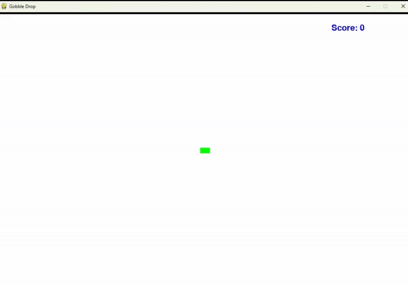

# basic-games

#### How To Play
1) Install Python onto your machine using the instructions [here](https://docs.python.org/3/using/mac.html)
2) [Clone](https://docs.github.com/en/repositories/creating-and-managing-repositories/cloning-a-repository#about-cloning-a-repository) this "basic-games" repository
3) Open the terminal and navigate to the directory with the .py files
4) Start your game of choice with the command: `$ python gobble-drop-game.py`
5) Enjoy!

### Gobble Drop
How many gobble drops can you catch?! 

Beware... the bigger you get, the slower you become. 

Good luck!

